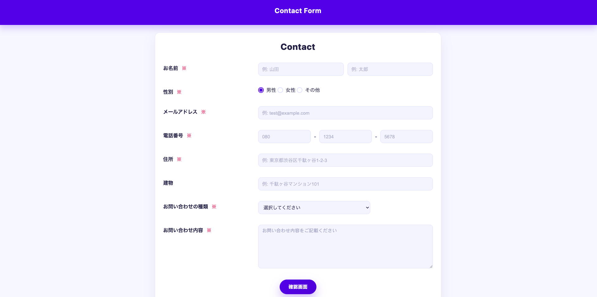
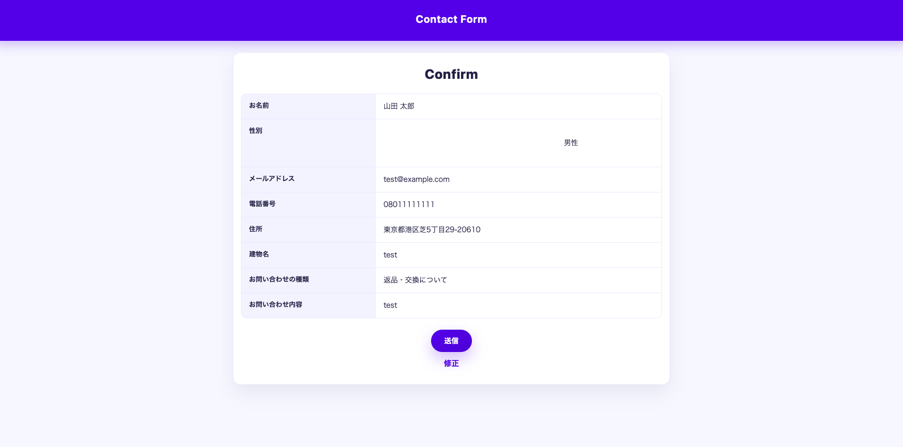
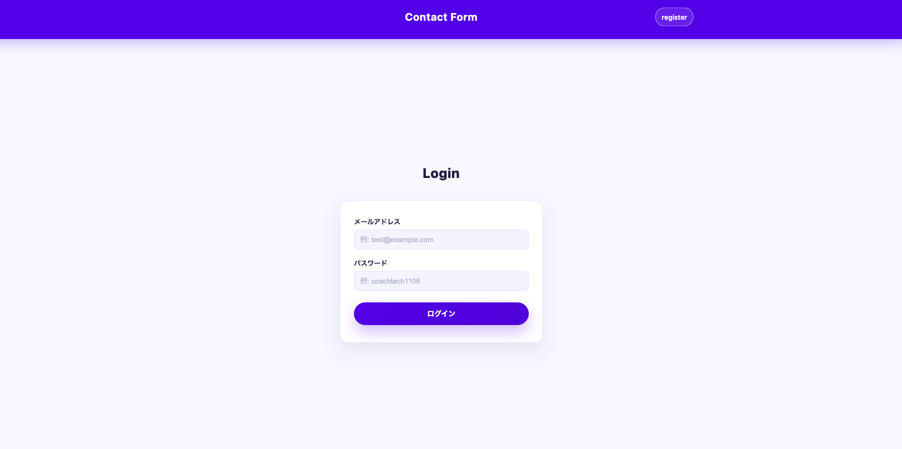
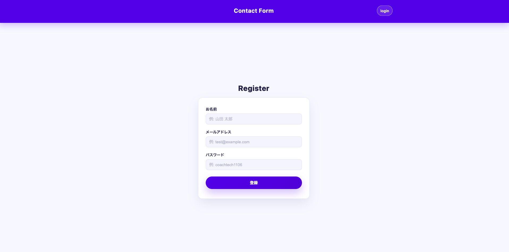
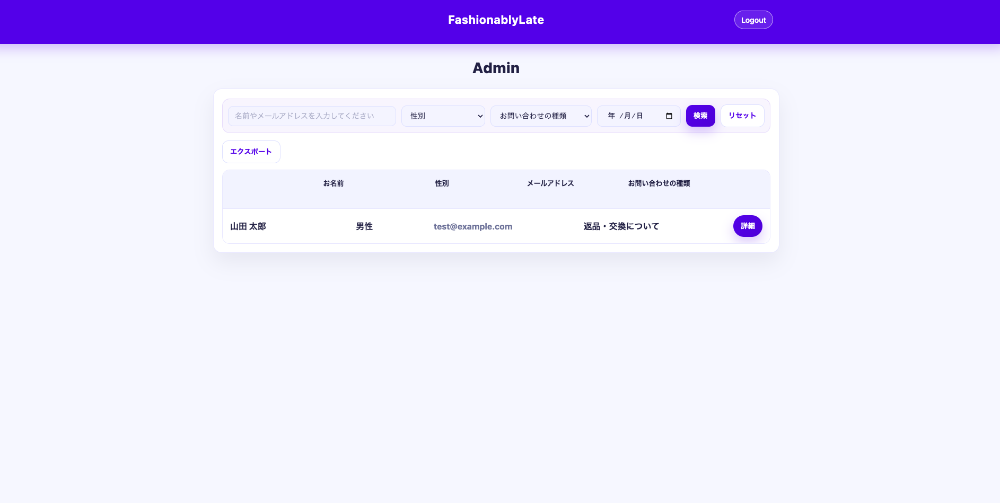

# お問い合わせフォーム

Laravel を用いて作成したお問い合わせ管理アプリケーションです。 
ユーザーがお問い合わせを送信し、管理者が内容を検索・管理できるシステムになっています。

## 環境構築

### Docker ビルド
```bash
git clone git@github.com:kozaken23/kakunin.git
cd kakunin
docker-compose up -d --build
docker-compose exec php bash
composer install
# .env ファイル作成
cp .env.example .env
# .env を編集して環境変数を設定
php artisan key:generate
php artisan migrate
php artisan db:seed
```


使用技術 <br>
・PHP 7.4.9 <br>
・Laravel 8.83.8 <br>
・MySQL 15.1 <br>

ER図

<br>

URL <br>
・開発環境: http://localhost/<br>
・phpMyAdmin http://localhost:8080/<br>

## 画面構成

本アプリケーションは、お問い合わせ管理機能を中心としたWebアプリです。  
以下は各画面の構成です。

---

### お問い合わせ画面


ユーザーがお問い合わせ内容を入力する画面です。

---

### 確認画面


入力内容を送信前に確認する画面です。

---

### 完了画面


お問い合わせ送信完了後に表示される画面です。

---

### ログイン画面


管理者がログインするための画面です。

---

### 📝 会員登録画面


管理者アカウントを新規作成する画面です。

---

### 管理画面


お問い合わせ内容の検索・一覧表示・詳細確認を行う管理画面です。


